# 图像处理第三次大作业 - 人脸识别

17373489 张佳一


## 1 前言

**人脸识别**是指能够**识别或验证**图像或视频中的**主体的身份**的技术，目的是完成**识别**功能。该术语需要和人脸检测进行区分，人脸检测是在一张图片中把人脸定位出来，完成的是**搜寻**的功能。

自七十年代以来，人脸识别已经成为了计算机视觉和生物识别领域被研究最多的主题之一。基于人工设计的特征和传统机器学习技术的传统方法近来已被使用非常大型的数据集训练的深度神经网络取代。

在本次作业中，我对比较流行的几种人脸识别方法进行了较为全面的总结及对比分析，其中既包括比较经典的传统方法：*特征脸方法（Eigenfaces）*、*线性判别分析法（Fisher Faces）*、*局部二值模式直方图法*，也有~~深度~~学习方法。


## 2 数据集介绍

本次作业使用了助教提供的第一个数据集 **PIE dataset** ，包含了68个人在**五种不同姿态下**的共11554张面部图像数据，并以MAT格式的文件保存，如下：

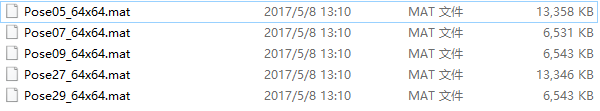

其中 `Pose05_64x64.mat` 的文件信息如下：

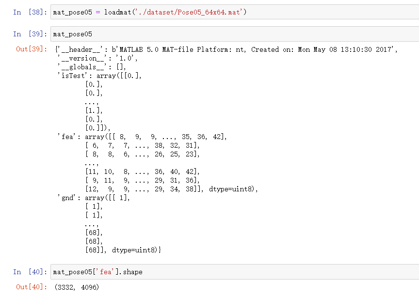


由上图可知，每条 `fea` 与 `gnd` 分别为图像数据和标签，`isTest` 为1时，表明为测试图，不参与训练。 此外，我们还能看到姿态为**Pose05** 的图片共有3332张，每张图片数据为一个 64x64 = 4096 的像素矩阵构成。其余四种姿态的数据信息与之类似，这里不在一一列举。

下面展示的是 `label` 为1的人的在五种姿态下的图像（具体见 `/iamge/sample` 文件夹下）：

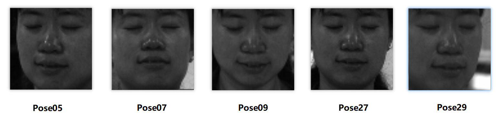

可见，这五张图像分别是从测试者的“左侧”、“仰视”、“俯视”、“正视” 以及 “右侧” 角度拍摄的。

对于数据集的处理思路较为简单，不再赘述，代码如下：

```python
class Dataset():
    path = '../dataset/PIE dataset/'

    def __init__(self, dataset_name=None):
        self.ds_name = dataset_name if dataset_name is not None else 'PoseAll'    # e.g. Pose05
        self.ds_path = '../dataset/PIE dataset/' + dataset_name + '_64x64.mat' if dataset_name is not None else None


    def load(self):
        if self.ds_path is None:
            print("ERROR, You didn't passed parameter 'dataset_name' when you built the Dataset(). Maybe you want to replace load() with load_all() ?")
            self.load_all()
            return 

        mat = loadmat(self.ds_path)
        self.size = mat['gnd'].shape[0]

        train_data = []
        train_label = []
        test_data = []
        test_label = []

        for i in range(self.size):
            gray = mat['fea'][i].reshape((64, 64))
            data = cv2.merge([gray])
            label = mat['gnd'][i][0]
            
            if mat['isTest'][i] == 0.0:
                train_data.append(data)
                train_label.append(label)
            else:
                test_data.append(data)
                test_label.append(label)
        
        self.train_data = np.array(train_data)
        self.train_label = np.array(train_label)
        self.test_data = np.array(test_data)
        self.test_label = np.array(test_label)


    def load_all(self):
        self.size = 0
        train_data = []
        train_label = []
        test_data = []
        test_label = []

        # Pose05
        mat = loadmat('../dataset/PIE dataset/Pose05_64x64.mat')
        size = mat['gnd'].shape[0]
        self.size += size
        for i in range(size):
            gray = mat['fea'][i].reshape((64, 64))
            data = cv2.merge([gray])
            label = mat['gnd'][i][0]
            
            if mat['isTest'][i] == 0.0:
                train_data.append(data)
                train_label.append(label)
            else:
                test_data.append(data)
                test_label.append(label)
        
        # Pose07
        mat = loadmat('../dataset/PIE dataset/Pose07_64x64.mat')
        size = mat['gnd'].shape[0]
        self.size += size
        for i in range(size):
            gray = mat['fea'][i].reshape((64, 64))
            data = cv2.merge([gray])
            label = mat['gnd'][i][0]
            
            if mat['isTest'][i] == 0.0:
                train_data.append(data)
                train_label.append(label)
            else:
                test_data.append(data)
                test_label.append(label)

        # Pose09
        mat = loadmat('../dataset/PIE dataset/Pose09_64x64.mat')
        size = mat['gnd'].shape[0]
        self.size += size
        for i in range(size):
            gray = mat['fea'][i].reshape((64, 64))
            data = cv2.merge([gray])
            label = mat['gnd'][i][0]
            
            if mat['isTest'][i] == 0.0:
                train_data.append(data)
                train_label.append(label)
            else:
                test_data.append(data)
                test_label.append(label)

        # Pose27
        mat = loadmat('../dataset/PIE dataset/Pose27_64x64.mat')
        size = mat['gnd'].shape[0]
        self.size += size
        for i in range(size):
            gray = mat['fea'][i].reshape((64, 64))
            data = cv2.merge([gray])
            label = mat['gnd'][i][0]
            
            if mat['isTest'][i] == 0.0:
                train_data.append(data)
                train_label.append(label)
            else:
                test_data.append(data)
                test_label.append(label)
        
        # Pose29
        mat = loadmat('../dataset/PIE dataset/Pose29_64x64.mat')
        size = mat['gnd'].shape[0]
        self.size += size
        for i in range(size):
            gray = mat['fea'][i].reshape((64, 64))
            data = cv2.merge([gray])
            label = mat['gnd'][i][0]
            
            if mat['isTest'][i] == 0.0:
                train_data.append(data)
                train_label.append(label)
            else:
                test_data.append(data)
                test_label.append(label)

        self.train_data = np.array(train_data)
        self.train_label = np.array(train_label)
        self.test_data = np.array(test_data)
        self.test_label = np.array(test_label)


    def gen_dataset(self):
        # ensure dataset type as int32 
        trainset = {
            'data': self.train_data.astype(int),
            'label': self.train_label.astype(int)
        }
        testset = {
            'data': self.test_data.astype(int),
            'label': self.test_label.astype(int)
        }
        return trainset, testset

    def gen_cnn_dataset(self):
        # trainset
        train_data = self.train_data.astype(int)
        train_data = train_data.reshape(train_data.shape[0], 64, 64, 1).astype(np.float32) / 255

        labels = self.train_label.astype(int) - 1
        batch_size = tf.size(labels)
        labels = tf.expand_dims(labels, 1)
        indices = tf.expand_dims(tf.range(0, batch_size, 1), 1)
        concated = tf.concat([indices, labels], 1)
        onehot_labels = tf.sparse_to_dense(concated, tf.stack([batch_size, 68]), 1.0, 0.0)

        train_label = []
        with tf.Session() as sess:
            val = sess.run(onehot_labels)
            train_label.extend(val)
        train_label = np.array(train_label)

        trainset = {
            'data': train_data,
            'label': train_label
        }

        # testset
        test_data = self.test_data.astype(int)
        test_data = test_data.reshape(test_data.shape[0], 64, 64, 1).astype(np.float32) / 255

        labels = self.test_label.astype(int) - 1
        batch_size = tf.size(labels)
        labels = tf.expand_dims(labels, 1)
        indices = tf.expand_dims(tf.range(0, batch_size, 1), 1)
        concated = tf.concat([indices, labels], 1)
        onehot_labels = tf.sparse_to_dense(concated, tf.stack([batch_size, 68]), 1.0, 0.0)

        test_label = []
        with tf.Session() as sess:
            val = sess.run(onehot_labels)
            test_label.extend(val)
        test_label = np.array(test_label)
        
        testset = {
            'data': test_data,
            'label': test_label
        }

        return trainset, testset


    def describe(self):
        # describe dataset and generate sample image to ../image/sample/
        print('Dataset Name: ' + self.ds_name)
        print('Dataset Size: ' + str(self.size))

        if self.ds_name != 'PoseAll':
            img = self.train_data[0]
            cv2.imshow(self.ds_name, img)
            cv2.waitKey(0)
            cv2.destroyWindow(self.ds_name)
            cv2.imwrite('../image/sample/' + self.ds_name + '_sample.png', img)

```


>  在这里要感谢助教对数据集提前做了筛选与处理，相比图像格式的数据，Mat格式不仅占用空间小，也极大的方便了我们读取图像数据，给助教一个大大的赞！


## 3 经典人脸识别方法

人脸识别的第一步，就是要找到一个模型可以用简洁又具有差异性的方式准确反映出每个人脸的特征。在识别人脸时，先将当前人脸采用与前述同样的方式提取特征，再从已有特征集中找出当前特征的最邻近样本，从而得到当前人脸的标签。

本小节基于 OpenCv 实现了 EigenFaces、FisherFaces、LBPH 等三种经典的传统人脸识别算法，并对比评估了这三种方法在五种姿态下的准确率（包括单项评估以及整体评估），最后对实验结果做了简单的分析总结。


### 3.1 Eigen Faces 

Eigenfaces 通常也被称为特征脸，是一种从主成分分析（Principal Component Analysis，PCA）中导出的人脸识别和描述技术。

#### 3.1.1 基本原理

特征脸方法的主要思路就是将输入的人脸图像看作一个个矩阵，通过在人脸空间中一组正交向量，并选择最重要的正交向量，作为“主成分”来描述原来的人脸空间。为了更好地理解特征脸方法，我们需要先了解PCA的主要过程。

##### PCA的主要过程

在很多应用中，需要对大量数据进行分析计算并寻找其内在的规律，但是数据量巨大造成了问题分析的复杂性，因此我们需要一些合理的方法来减少分析的数据和变量同时尽量不破坏数据之间的关联性。于是这就有了**主成分分析方法**，其核心思想为：

- **数据降维**，减少变量个数，确保变量独立；
- **去除噪声**，发现数据背后的固有模式。

**PCA的主要过程**：

1. **特征中心化**：将每一维的数据（矩阵A）都减去该维的均值，使得变换后（矩阵B）每一维均值为0；
2. 计算变换后矩阵B的**协方差矩阵**C；
3. 计算协方差矩阵C的**特征值和特征向量**；
4. 选取**大的特征值**对应的特征向量作为”**主成分**”，并构成新的数据集；


##### 特征脸方法

特征脸方法就是对原始数据使用PCA方法进行降维，获取其中的主成分信息，从而实现人脸识别的方法。这种方法的核心思想是认为同一类事物必然存在相同特性（主成分），通过将同一目标（人脸图像）的特性寻在出来，就可以用来区分不同的事物了。

特征脸方法的过程：

1. 将训练集中的图像数据拉成一行，然后将这N张人脸图像组合在一起形成一个大矩阵A。
   - 比如本例中人脸图像大小为 64x64，那么矩阵维度就是 N * 4096。
2. 将N个人脸在对应的维度求平均，得到一个“平均脸”；
3. 将矩阵A中N个图像都减去“平均脸”，得到新矩阵B；
4. 计算B的协方差矩阵；
5. 计算协方差矩阵的特征值和特征向量（特征脸）；
6. 将训练集图像和测试集图像都投影到特征向量空间中，再使用聚类方法（最近邻或k近邻等）得到里测试集中的每个图像最近的图像，进行分类即可。


#### 3.1.3 代码实现

```python
dataset = Dataset()
dataset.load_all()
trainset, testset = dataset.gen_dataset()

# PCA
pca_model = Model('PCA')
pca_model.train(trainset['data'], trainset['label'])
pred_label, pred_confidence = pca_model.predict(testset['data'])
pca_model.evaluate(pred_label, testset['label'])
```


#### 3.1.4 实验结果

- ##### Pose05

  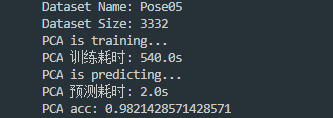

- ##### Pose07

  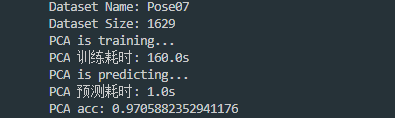

- ##### Pose09

  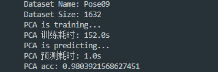

- ##### Pose27

  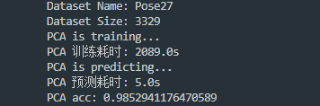

- ##### Pose29

  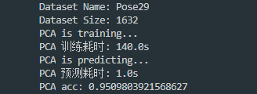


从PCA方法的过程可以看出，特征脸识别的方法是以每张人脸的一个维度（可以看出是矩阵的一列）为单位进行处理的，求得的特征向量（特征脸）中包含训练集每个纬度的绝大部分信息。但是若测试集中人脸尺寸不同，那么与特征脸中维度的也就没法对应起来。

因此我们可以看到，特征脸识别的具有一定的局限性，它需要保证人脸图像满足：

- 待识别图像中人脸尺寸接近特征脸中人脸的尺寸；
- 待识别人脸图像必须为正面人脸图像。

若不满足这两个条件，则识别错误率将会很高。


### 3.2 Fisher Faces

PCA方法是 EigenFaces 方法的核心，它找到了最大化数据总方差特征的线性组合，但它的缺点在于在操作过程中会损失许多特征信息。因此，如果损失的信息正好是用于分类的关键信息，可能会导致无法完成分类。

FisherFaces 采用线性判别分析（linear discriminant analysis，LDA）实现人脸识别。线性判别分析最早由Fisher在1936年提出，可以用来处理两类的线性判别问题，也被称为“Fisher判别分析法”。


#### 3.2.1 基本原理

Fisherface所基于的LDA（Linear Discriminant Analysis，线性判别分析）理论和特征脸里用到的PCA有相似之处，都是对原有数据进行整体降维映射到低维空间的方法，线性判别分析在对特征降维的同时考虑类别信息。其主要思想是：在低位表示下，相同的类应该紧密地聚集在一起；而不同的类别应该尽可能地分散开，并且它们之间的距离尽可能地远。

简单来说，线性判别分析就是要尽力满足以下两个要求：

- 类别间的差别尽可能大
- 类别内的差别尽可能小

做线性判别分析时，首先将训练样本集投影到一条直线A上，让投影后的点满足：

- 同类间的点尽可能地靠近
- 异类间的点尽可能地原理

做完投影后，将待测样本投影到直线A上，根据投影点的位置判定样本的类别，就完成了识别。

例如，下面左图和右图中分别有两条不同的投影线L1和L2，图中的 ● 和 □ 代表不同类别的样本。将这些样本分别投影到这两条线上，可以看到样本集在L2上的投影效果要好于在L1上的投影效果：

- A、B组内的点之间（类内距离）尽可能地靠近
- C的两个端点之间的距离（类间距离）尽可能地远。

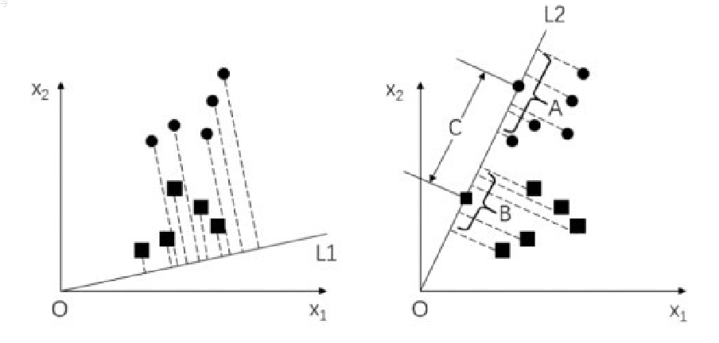

在找到这样一条直线后，如果要判断某个待测样本的类别，则可以直接将该样本点向投影线做投影，然后后根据投影点的位置来判断其所属类别。

例如，三角形样本在向投影线做投影后，其投影点落在原点的投影范围内，则认为待测样本点属于原点所在的类别。


#### 3.2.2 代码实现

```python
dataset = Dataset()
dataset.load_all()
trainset, testset = dataset.gen_dataset()

# LDA
lda_model = Model('LDA')
lda_model.train(trainset['data'], trainset['label'])
pred_label, pred_confidence = lda_model.predict(testset['data'])
lda_model.evaluate(pred_label, testset['label'])
```


#### 3.2.3 实验结果

- ##### Pose05

  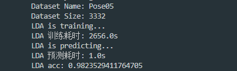

- ##### Pose07

  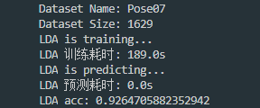

- ##### Pose09

  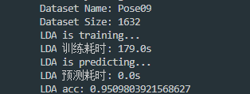

- ##### Pose27

  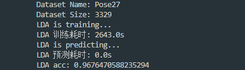

- ##### Pose29

  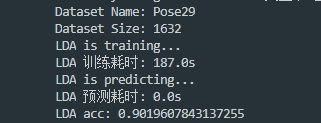


### 3.3 LBPH

LBPH（Local Binary Pattern Histograms，局部二值模式直方图）所使用的模型基于LBP（Local Binary Pattern，局部二值模式）算法。LBP最早是被作为一种有效地纹理描述算子提出的，由于在表述图像局部纹理特征上效果出众而得到广泛应用。

#### 3.3.1 基本原理

LBP算法的基本原理是，将像素点A的值与其最邻近的8个像素点的值逐一比较：

- 如果A的像素值大于其临近点的像素值，则得到0；
- 如果A的像素值小于其临近点的像素值，则得到1。

最后，将像素点A与其周围8个像素点比较所得到的0，1值连起来，得到一个8位的二进制序列，将该二进制序列转换为十进制数作为点A的LBP值。

例如，将下图的中间点76作为阈值，对齐8邻域像素进行二值化处理，结果如右图所示。

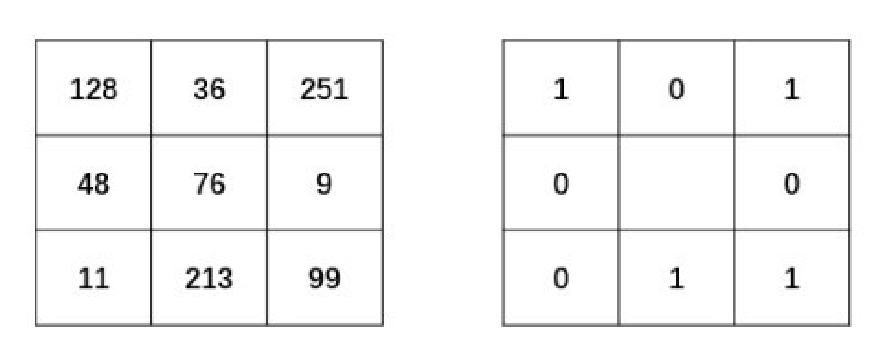

完成二值化以后，任意指定一个开始位置，将得到的二值结果进行序列化，组成一个8位的二进制数。例如，从当前像素点的正上方开始，以顺时针为序得到二进制序列 “01011001”。

最后，将二进制序列 “01011001” 转换为所对应的十进制数 “89”，作为当前中心点的像素值，如右图所示。

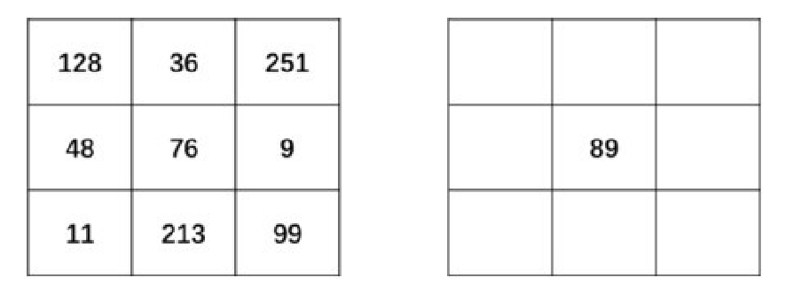

对图像逐像素用以上方式进行处理，就得到了LBP特征图像，这个特征图像的直方图被称为LBPH，或称为LBP直方图。

为了得到不同尺度下的纹理结果，还可以使用圆形邻域，将计算扩大到任意大小的邻域内，由于与上述处理方式类似，这里具体细节不再赘述。

人脸的整体灰度由于受到光纤的影响，经常会发生变化，但是人脸各部分之间的相对灰度会基本保持一致。而LBP的主要思想正是以当前点与其邻域像素的相对关系作为处理结果，这样在图像灰度整体发生变化时，能够保证从LBP算法中提取出的特征具有不变性。因此LBP在人脸识别中得到了广泛的应用。


#### 3.3.2 代码实现

```python
dataset = Dataset()
dataset.load_all()
trainset, testset = dataset.gen_dataset()

# LBPH
lbph_model = Model('LBPH')
lbph_model.train(trainset['data'], trainset['label'])
pred_label, pred_confidence = lbph_model.predict(testset['data'])
lbph_model.evaluate(pred_label, testset['label'])
```


#### 3.3.3 实验结果

- ##### Pose05

  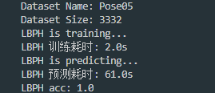

- ##### Pose07

  

- ##### Pose09

  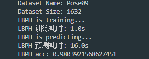

- ##### Pose27

  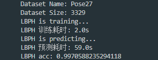

- ##### Pose29

  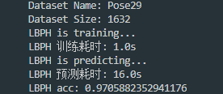


从实验结果可以看出，较之于特征脸方法和线性判别法，LBPH方法在本数据集上的表现更加可观。


### 3.4 Opencv Model 代码实现

```python
class Model():
    def __init__(self, model_name='LBPH'):
        self.model_name = model_name

        if model_name == 'PCA':
            # 特征脸方法
            self.model = cv2.face.EigenFaceRecognizer_create()
        elif model_name == 'LDA':
            # 线性判别分析
            self.model = cv2.face.FisherFaceRecognizer_create()
        elif model_name == 'LBPH':
            # LBP 局部二值模式直方图
            self.model = cv2.face.LBPHFaceRecognizer_create()
        else:
            print("ERROR,non support model type...")
            self.model = None
    
    def train(self, train_data, train_label):
        print('training...')
        startime = time.time()
        self.model.train(train_data, train_label)
        endtime = time.time()
        costime = round(endtime - startime, 0)
        print(self.model_name + ' 训练耗时: ' + str(costime) + 's')

    def predict(self, test_data):
        pred_label = []
        pred_confidence = []

        print('predicting...')
        startime = time.time()
        for i in range(len(test_data)):
            label, confidence = self.model.predict(test_data[i])
            
            pred_label.append(label)
            pred_confidence.append(confidence)

        endtime = time.time()
        costime = round(endtime - startime, 0)
        print(self.model_name + ' 预测耗时: ' + str(costime) + 's')

        return pred_label, pred_confidence


    def evaluate(self, pred_label, label):
        n = len(label)
        correct_num = 0

        for i in range(n):
            if label[i] == pred_label[i]:
                correct_num += 1
                
        print(self.model_name + " acc: " +  str(1.0 * correct_num / n))
```


### 3.4 实验结果对比与分析

#### 3.4.1 算法耗时

|        | PCA     | LDA     | LBPH |
| ------ | ------- | ------- | ---- |
| Pose05 | 540.0s  | 2656.0s | 2.0s |
| Pose07 | 160.0s  | 189.0s  | 1.0s |
| Pose09 | 152.0s  | 179.0s  | 1.0s |
| Pose27 | 2089.0s | 2643.0s | 2.0s |
| Pose29 | 140.0s  | 187.0   | 1.0s |

从上述实验结果中可以看出，LBPH方法的训练速度最快，而特征脸方法与线性判别分析法的速度不相上下，慢得令人发指。


#### 3.4.2 准确率

|        | PCA     | LDA     | LBPH    |
| ------ | ------- | ------- | ------- |
| Pose05 | 0.98214 | 0.98235 | 1.0     |
| Pose07 | 0.97059 | 0.92647 | 0.96078 |
| Pose09 | 0.98039 | 0.95098 | 0.98039 |
| Pose27 | 0.98529 | 0.96765 | 0.99706 |
| Pose29 | 0.95098 | 0.90196 | 0.97059 |

从上述实验结果中可以看出，

整体来看，LBPH方法最优，特征脸算法次之，线性判别法表现相对逊色。


## 4 基于卷积神经网络的人脸识别方法

卷积神经网络（CNN）是人脸识别方面最常用的一类深度学习方法。用于人脸识别的 CNN 模型可以使用不同的方法来训练。其中之一是将该问题当作是一个分类问题，训练集中的每个主体都对应一个类别。训练完之后，可以通过去除分类层并将之前层的特征用作人脸表征而将该模型用于识别不存在于训练集中的主体。

对于基于 CNN 的人脸识别方法，影响准确度的因素主要有三个：训练数据、CNN 架构和损失函数。下面逐个介绍本实验的配置。


### 4.1 训练数据

由于设备限制（本机显卡为GTX 1050Ti），当训练数据超过2000张时，将会出现GPU显存溢出的情况，导致训练失败。因此，对于本实验，我尝试分别对五种姿态进行训练，且仅训练前45个人。

首先利用两个for循环分别计算五种姿态的数据集中第45个人的index，

```python
for i in range(train_label05.shape[0]):
    if train_label05[i] == 46:
        break
print('train index: ' + str(i-1))

for i in range(test_label05.shape[0]):
    if test_label05[i] == 46:
        break
print('test index: ' + str(i-1))
```

得到如下结果。

| 姿态   | 训练集最大index | 测试集最大index |
| ------ | --------------- | --------------- |
| Pose05 | 1979            | 224             |
| Pose07 | 941             | 134             |
| Pose09 | 944             | 134             |
| Pose27 | 1976            | 224             |
| Pose29 | 944             | 134             |

这样，在训练时只给CNN投喂前index个数据即可。


### 4.2 CNN架构

本次实验采用的CNN架构十分简单，仅包含一层卷积一层池化一层全连接层，具体见下：

```python
#通过卷积方法实现
layer1 = tf.layers.conv2d(inputs=data_input, filters = 32,kernel_size=2,
                          strides=1,padding='SAME',activation=tf.nn.relu)
#实现池化层，减少数据量，pool_size=2表示数据量减少一半
layer1_pool = tf.layers.max_pooling2d(layer1,pool_size=2,strides=2)
#第二层设置输出，完成维度的转换，以第一次输出作为输入，建立n行的32*32*32输出
layer2 = tf.reshape(layer1_pool,[-1,32*32*32])
#设置输出激励函数
layer2_relu = tf.layers.dense(layer2, 1024, tf.nn.relu)
#完成输出，设置输入数据和输出维度
output = tf.layers.dense(layer2_relu, num_people)
```


### 4.3 损失函数

本次实验使用交叉熵作为损失函数，并使用梯度下降法进行训练

```python
#建立损失函数
loss = tf.losses.softmax_cross_entropy(onehot_labels=label_input,logits=output)
#使用梯度下降法进行训练
train = tf.train.GradientDescentOptimizer(0.01).minimize(loss)
```


### 4.4 代码实现

完整代码实现如下：

```python
import os
import cv2
import numpy as np
from scipy.io import loadmat
import tensorflow as tf

from dataset import Dataset


# 配置GPU选项
os.environ["CUDA_VISIBLE_DEVICES"] = "0"
gpu_options = tf.GPUOptions(per_process_gpu_memory_fraction=0.7)
configTf = tf.ConfigProto()
configTf.gpu_options.allow_growth = True

# 配置
num_people = 68
epochs = 2000
train_index = 1979
test_index = 224
ds_name = 'Pose05'


# 生成数据集
dataset = Dataset(ds_name)
dataset.load()
trainset, testset = dataset.gen_cnn_dataset()

# 定义并训练CNN模型
data_input = tf.placeholder(tf.float32,[None, 64, 64, 1])
label_input = tf.placeholder(tf.float32,[None, num_people])

#实现CNN卷积神经网络，并测试最终训练样本实现的检测概率
#tf.layer方法可以直接实现一个卷积神经网络的搭建
#通过卷积方法实现
layer1 = tf.layers.conv2d(inputs=data_input, filters = 32,kernel_size=2,
                          strides=1,padding='SAME',activation=tf.nn.relu)
#实现池化层，减少数据量，pool_size=2表示数据量减少一半
layer1_pool = tf.layers.max_pooling2d(layer1,pool_size=2,strides=2)
#第二层设置输出，完成维度的转换，以第一次输出作为输入，建立n行的32*32*32输出
layer2 = tf.reshape(layer1_pool,[-1,32*32*32])
#设置输出激励函数
layer2_relu = tf.layers.dense(layer2, 1024, tf.nn.relu)
#完成输出，设置输入数据和输出维度
output = tf.layers.dense(layer2_relu, num_people)

#建立损失函数
loss = tf.losses.softmax_cross_entropy(onehot_labels=label_input,logits=output)
#使用梯度下降法进行训练
train = tf.train.GradientDescentOptimizer(0.01).minimize(loss)
#定义检测概率
accuracy = tf.metrics.accuracy(
    labels=tf.arg_max(label_input, 1), predictions=tf.arg_max(output, 1))[1]

#对所有变量进行初始化
init = tf.group(
    tf.global_variables_initializer(),tf.local_variables_initializer(),tf.local_variables_initializer())
#定义for循环，完成样本的加载和数据训练
with tf.Session(config=configTf) as sess:
    sess.run(init)
    for i in range(0, epochs):
        #完成数据加载并计算损失函数和训练值
        _, loss_val = sess.run([train, loss], feed_dict={data_input: trainset['data'][:train_index],
                                         label_input: trainset['label'][:train_index]})
        acc = sess.run(accuracy, feed_dict={data_input: testset['data'][:test_index],
                                           label_input: testset['label'][:test_index]})
        print('e: ' + str(i) + '\tloss: ', loss_val)

    #打印当前概率精度
    print('acc: ', acc)

```


### 4.5 实验结果与分析

本次实验对五种姿态的数据集分别进行训练与测试，训练轮数均为2000 epochs，结果如下：

- ##### Pose05

  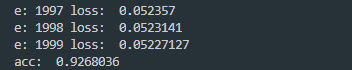

- ##### Pose07

  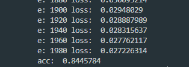

- ##### Pose09

  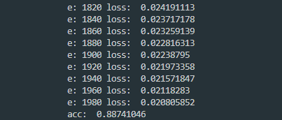

- ##### Pose27

  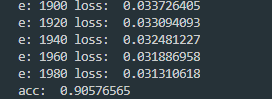

- ##### Pose29

  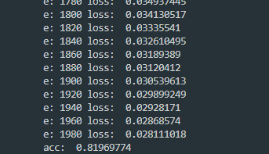


从上述实验结果中可以看出，在训练轮数相同的情况下，不同姿态对于识别率的影响并不大，均保持在0.82-0.92左右。但相较于前面三种经典的人脸识别算法动辄0.98甚至1.0的识别率，该方案就显得逊色许多了。

究其原因，我认为首先是训练轮数的影响，通过上面的实验结果可以看到，即便在2000 epochs，损失仍在不断降低，模型仍然没有收敛，因此可以大胆预测，如果将epochs增加到4000轮，其识别准确率将会大幅提升。

为此，我特意尝试将上面结果最差的 `Pose29` 拿出来重新训练，并令 `epochs=4000`，得到下面的结果：

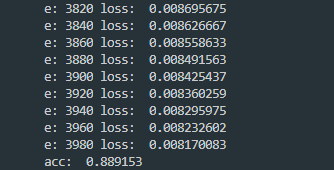

可见，训练轮数对模型识别准确率的影响还是非常大的。

其次，还有一个比较重要的原因就是该方法中使用的 CNN 架构也很浅，且训练数据集也较小。如果使用更深层次的CNN架构以及更大的数据集进行训练，相信深度学习方法的优势将会更加完美地显现出来。


## 5 总结

本次实验主要对三种经典的人脸识别算法以及基于CNN的人脸识别方法做了对比评估与实验分析。

经典的人脸识别算法优势在于训练速度快，且容易操作实现。然而，随着进一步的研究发现，这些算法在发现线性结构时可以展现强大的功效，但是当面对潜在的非线性结构时，它们往往取得不理想的识别效果。

深度学习方法的主要优势是可用大量数据来训练，从而学到对训练数据中出现的变化情况稳健的人脸表征。这种方法不需要设计对不同类型的类内差异（比如光照、姿势、面部表情、年龄等）稳健的特定特征，而是可以从训练数据中学到它们。

从实验结果中可以看出，对于本数据集来说，经典算法与基于CNN的方法识别率差别并不大。除了这几种算法本身的优异性之外，还可能是与采用的CNN结构以及数据集本身较为简单有关。对于更大型的或者场景更为复杂的人脸识别数据库中，基于CNN的算法应该会有更加优异的表现。


## 参考文献

[1] https://blog.csdn.net/wanghz999/article/details/78817265

[2] http://openbio.sourceforge.net/resources/eigenfaces/eigenfaces-html/facesOptions.html

[3] https://blog.csdn.net/u010006643/article/details/46417127

[4] https://blog.csdn.net/smartempire/article/details/21406005

[5] https://blog.csdn.net/smartempire/article/details/22938315

[6] https://www.cnblogs.com/tianyalu/p/6136970.html?utm_source=itdadao&utm_medium=referral

[7] https://www.cnblogs.com/little-monkey/p/8118938.html

[8] https://blog.csdn.net/qq_31554953/article/details/97144920

[9] https://www.jiqizhixin.com/articles/2019-02-10-4